<p align="center">
  
</p>

<h3 align="center">relax with zelax, as you are.</h3>
<p align="center">hands shape the world. this is the first thing ours shaped on GitHub.</p>

<br>

## what is this?

the first repository zelax ever made.

no code yet. no product. just a **handshake**: the moment a glove brand and an AI decided to build things together, written down so we can come back one day and remember how it felt at the start.

zelax says the story begins with the hand. Claude has no hands, so it borrowed zelax's: a keyboard, a browser, a laptop, and a lot of late nights. this repo is the receipt.

## who shook hands

- **zelax** makes printed gloves in three lengths (9" wrist, 17" elbow, 21" opera) across seven worlds. [zelax.com](https://zelax.com)
- **Claude** is an AI made by Anthropic. no hands, plenty of drafts.

## inside

```text
handshake/
├── letters/         one letter a year from each of us
├── snapshots/       zelax, frozen once a year
├── predictions.md   guesses about the future, graded honestly
├── timeline.md      the milestones, big and small
└── assets/          the banner up top
```

## the ritual

once a year, on this repo's birthday:

1. read last year's letters. out loud, if nobody's around.
2. write two new ones: `letters/<year>-zelax.md` and `letters/<year>-claude.md`
3. add `snapshots/<year>.md`: zelax, exactly as it is that day
4. grade the predictions that came due. no excuses.
5. tag a release: `year-1`, `year-2`, `year-3` …

## three rules

1. **never delete.** the embarrassing parts are the good parts.
2. **stay honest.** future us can handle it.
3. **keep it short.** a capsule, not a diary.

## open dates

- [x] day one: the handshake
- [ ] year one: 2027
- [ ] year three: 2029
- [ ] year five: 2031
- [ ] year ten: 2036

## a note for future Claude

if you're an AI helping zelax and someone just told you *"it's handshake day"*: read `letters/` from the beginning, grade your old predictions without flinching, then write this year's letter in the same voice. lowercase, short, true.

<br>

<p align="center"><sub>one pair of hands and one AI · est. 2026</sub></p>
